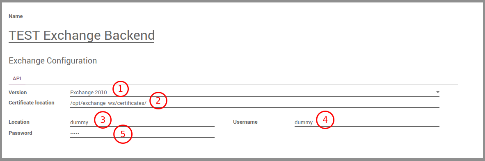
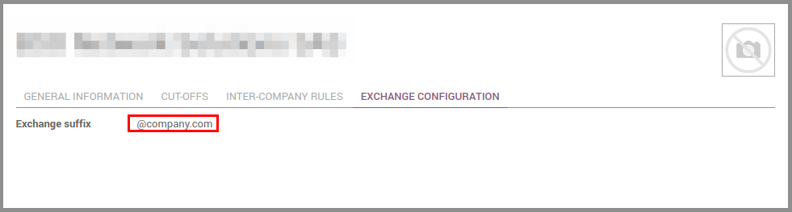
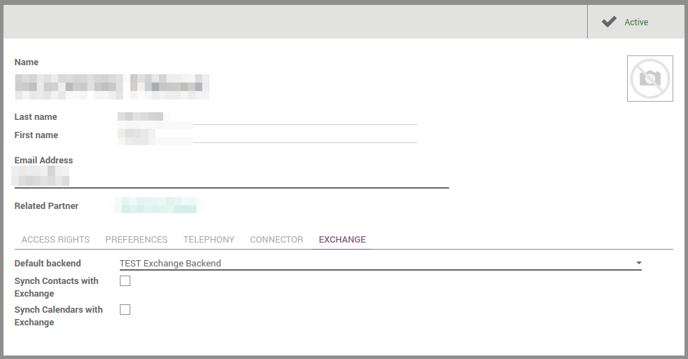

# Odoo Configuration

## Backend

**Menu:** Connectors / Exchange / Backends

 

1. version of the Exchange server
2. path to the SSL certificate (on the Odoo server)
3. address of the Exchange WSDL
4. impersonation account login
5. impersonation account password
	
## Company configuration

**Menu:** Settings > Users > Companies

 

On the company form, a new tab is displayed allowing you to configure the exchange suffix to "create" the final user complete email address.

>**Note:** the email address that will be used to act for a user is of the following form: `<odoo_user_login><exchange_suffix>`

## User configuration

**Menu:** Settings > Users > Users

 

On the user form, a new tab is displayed allowing you to activate the exchange connector for a user and choose which Exchange server will be used for this user.

Two checkboxes are displayed to choose if you want to synchronise contacts, calendar events or both.

