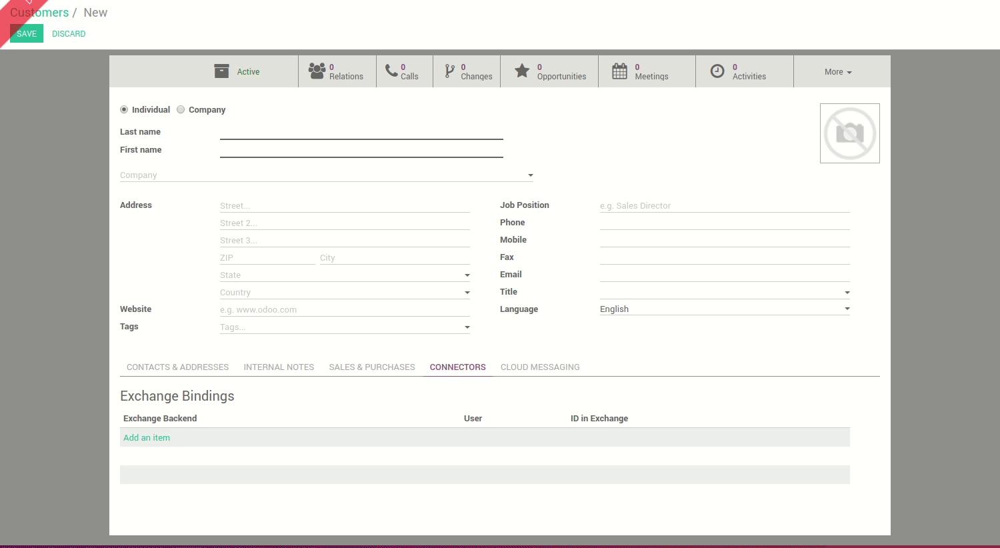

# Exporting contacts

## Pre-requisites

You must have activated the contact sync on user form view to be able to export contacts.

## How it works

### TL;DR

Export of contact is **not** done automatically by Odoo.

Each user have to *bind* themselves on the contacts/customers he wants. This choice has been made not to sync automatically every created contact in Odoo to Exchange.

### More explainations

Logged as a user for whom contacts sync is enabled, simply go on the customers/contacts and create a contact.

On the customer form, the user has to bind manually this contact to exchange. The process to *bind* is showed in the following screencast.

 
