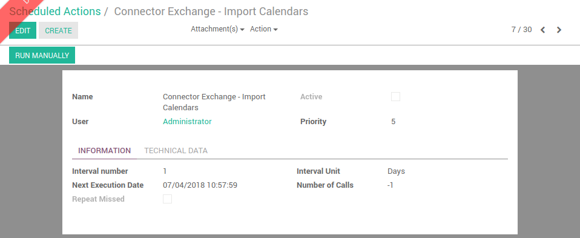

# Importing calendar events

## Pre-requisites

You must have activated the calendar sync on user form view to ba able to import calendar events.

## How it works

### TL;DR

Import of a calendar event is done by a scheduled task in Odoo.

### More explainations

A scheduled task is defined to import calendar events for all users who enabled the feature.

 

This scheduled action is disabled by default. You can configure it for it to run when you want.

### Which calendar events are imported

Only the calendar events compliants with the following 3 rules are imported:

1. They belongs to the main Exchange calendar of the user
2. They are not private nor personal
3. The "Odoo" category is set on the event 