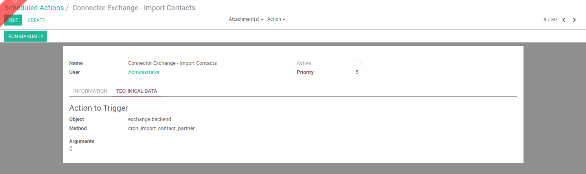

# Importing contacts

## Pre-requisites

You must have activated the contact sync on user form view to be able to import contacts.

## How it works

### TL;DR

Import of contacts is done by a scheduled task in Odoo.

### More explainations

A scheduled task is defined to import contacts for all users who enabled the feature.

 

This scheduled action is disabled by default. You can configure it for it to run when you want.

### Which contacts are imported

Only the contacts compliants with the following 2 rules are imported:

1. They belongs to the main contact directory of the user
1. The "Odoo" category is set on the contact